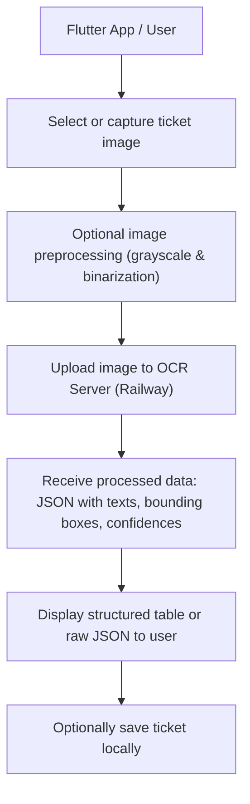

# Flutter Ticket OCR App (User Side)

This Flutter app allows users to capture or select ticket images, preprocess them, and send them to a remote server for OCR (Optical Character Recognition). The processed data is returned as a structured table and displayed within the app.

## Features

- Capture images from the gallery or camera.
- Preprocess images (grayscale conversion, binarization).
- Send images to the server for OCR processing.
- Receive structured ticket data (JSON) from the server.
- Display OCR results in a table or raw JSON view.
- Store ticket locally for future reference.

## User Flow

How It Works
Select Image: Users pick an image from the gallery using the image_picker plugin.

Preprocess Image:

Convert image to grayscale.

Binarize image using a threshold (default: 128).

Save preprocessed image temporarily in the app's cache directory.

Upload Image:

The image is sent to the server using http.MultipartRequest.

Both the original and preprocessed image can be uploaded.

Receive OCR Response:

The server returns a JSON with:

original_texts: Raw detected text.

cleaned_texts: Text after cleaning and normalization.

confidences: OCR confidence scores.

bboxes: Bounding boxes for detected text regions.

Display Results:

Show a structured table for easy reading.

Optionally display the raw JSON for debugging.

Save Tickets: Users can store the ticket locally for future reference.

Example Code Snippet (Upload & Display)
dart
Copy code
Future<void> _pickPreprocessAndUploadImage() async {
  final picker = ImagePicker();
  final pickedFile = await picker.pickImage(source: ImageSource.gallery);
  if (pickedFile != null) {
    final preprocessedFile = await _preprocessImage(File(pickedFile.path));
    if (preprocessedFile != null) {
      setState(() {
        selectedImage = preprocessedFile;
      });

      final request = http.MultipartRequest(
        'POST',
        Uri.parse('https://ocrticketing-production.up.railway.app/ocr'),
      );
      request.files.add(await http.MultipartFile.fromPath('file', preprocessedFile.path));

      final streamedResponse = await request.send();
      final response = await http.Response.fromStream(streamedResponse);
      if (response.statusCode == 200) {
        final data = jsonDecode(response.body);
        setState(() {
          originalTexts = data['original_texts'] ?? [];
          cleanedTexts = data['cleaned_texts'] ?? [];
          confidences = data['confidences'] ?? [];
          bboxes = data['bboxes'] ?? [];
        });
      } else {
        ScaffoldMessenger.of(context).showSnackBar(
          SnackBar(content: Text('Error: ${response.statusCode}')),
        );
      }
    }
  }
}
Dependencies
image_picker: Pick images from the gallery or camera.

http: Upload images and retrieve OCR responses.

image: Preprocess images (grayscale, binarization).

path_provider: Store temporary preprocessed images.

dart:io & dart:convert: File I/O and JSON parsing.

Notes
Image preprocessing improves OCR accuracy by normalizing lighting and removing noise.

Users can switch between table view and raw JSON for debugging.

The server handles the heavy lifting of OCR and table reconstruction.

