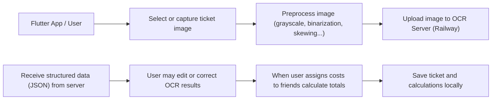
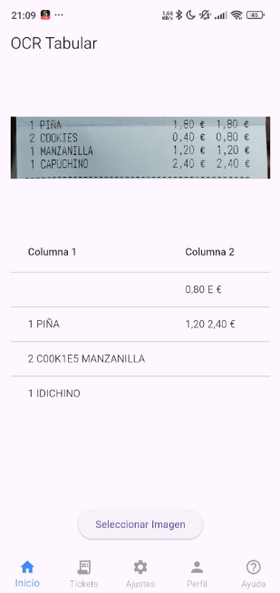
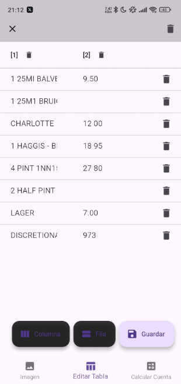
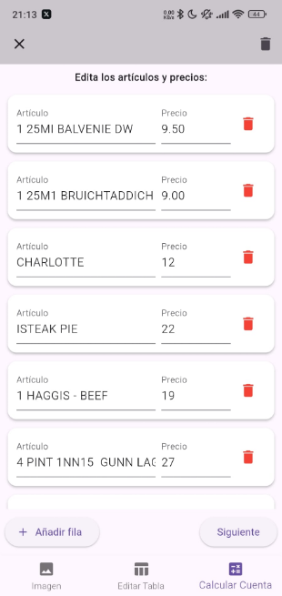
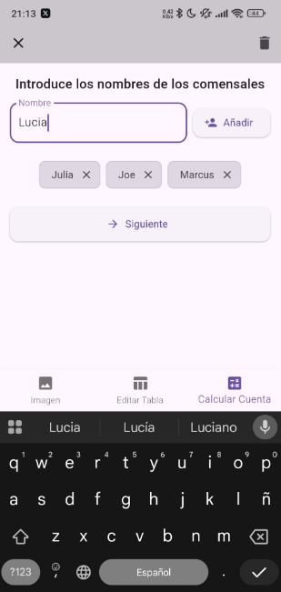
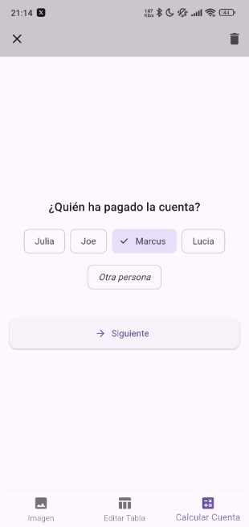
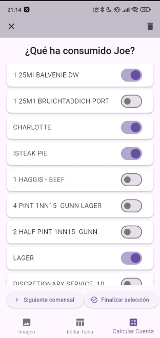
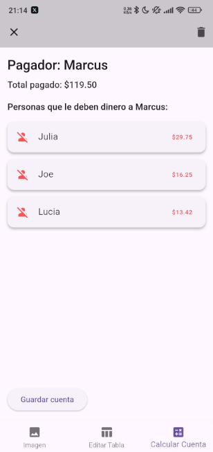
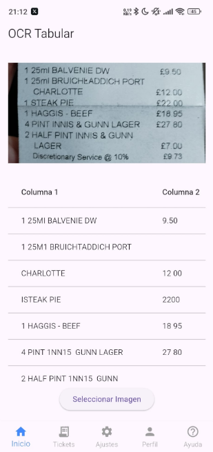

# 🧾 Flutter Ticket OCR App (User Side)

This Flutter app allows users to capture or select ticket images, preprocess them, and send them to a remote server for OCR (Optical Character Recognition). The app then lets users view, edit, and save the extracted data — making it easy to manage shared expenses like restaurant bills or event tickets.

## ✨ Features

📸 Capture or select images from the gallery or camera.

⚙️ Preprocess images (grayscale, binarization) to improve OCR accuracy.

☁️ Upload to OCR server and receive structured data (JSON).

🧠 Edit extracted information manually to fix OCR errors or add details.

💾 Save tickets locally for future access — even offline.

👥 Split bills easily: assign items or amounts to friends and calculate who owes what.

📊 View all tickets in a clean local history with totals and notes.

## 🔄 User Flow

## ⚙️ How It Works

## ⚙️ How It Works

| Step | Screenshot | Description |
|------|------------|-------------|
| 1️⃣ Select Image |  | Users can choose or capture an image of a ticket or bill using the `image_picker` plugin. |
| 2️⃣ View Ticket Info |  | After OCR, users see the extracted ticket information in a clean table view. |
| 3️⃣ Edit & Modify Ticket |  | Users can correct misread items, add missing prices, or update other ticket details. |
| 4️⃣ Choose People |  | Assign each item on the ticket to the friends who consumed it. |
| 5️⃣ Choose Payer |  | Select which friend paid the bill or split payment. |
| 6️⃣ Assign Items |  | Determine who consumed which items to calculate individual totals. |
| 7️⃣ Calculation Results |  | The app automatically calculates totals for each person based on consumption. |
| 8️⃣ Save Locally |  | All tickets (with edits and calculations) are stored securely on the device. Users can reopen them anytime, even offline. |

## 📦 Dependencies
Package	Purpose
image_picker	Capture or pick images
http	Upload images & receive OCR JSON
image	Image preprocessing
path_provider	Manage local storage paths
dart:io, dart:convert	File I/O & JSON parsing
sqflite / hive	Local ticket storage
provider / riverpod	State management
flutter_math / intl	Bill calculations & formatting

## 🗂️ Local Data Storage
Tickets are stored locally with:
Processed OCR text and metadata
Editable fields (title, date, location, etc.)
Friend-based bill splits
Notes or tags

📝 Notes
* 

Preprocessing helps improve OCR accuracy by removing noise and adjusting contrast.

All data (tickets, notes, friends, calculations) remain local and private to the device.

You can expand the app to sync with the cloud or share tickets between users in future versions.
